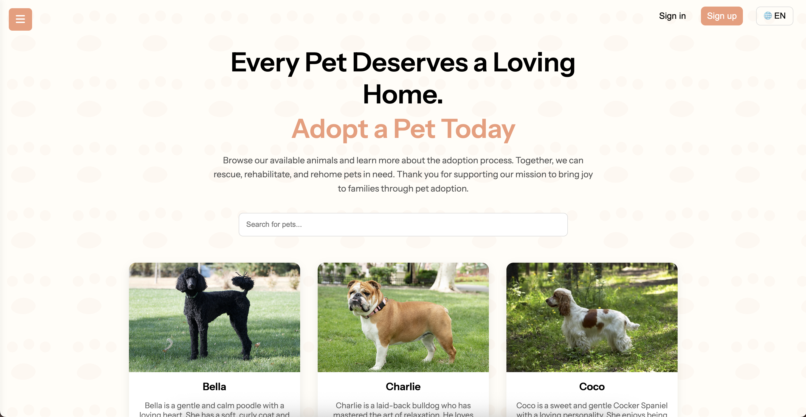
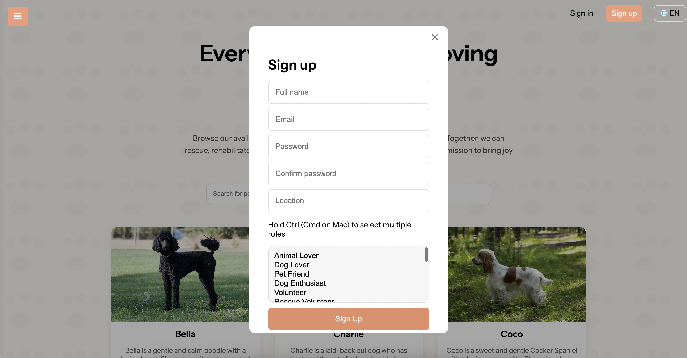
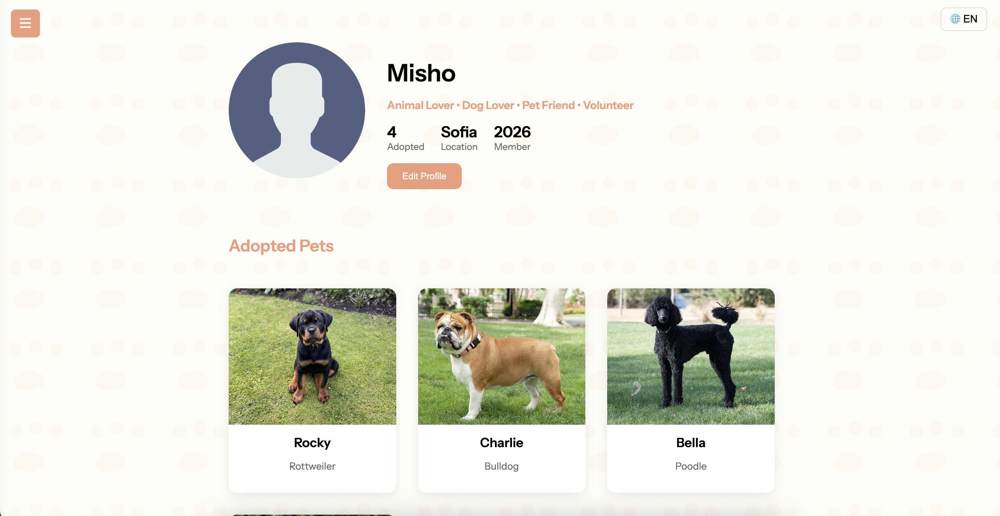

# 🐾 Home4Paws – Dog Adoption Platform

A modern web application that makes adopting your next furry friend easier, secure, and multilingual. Features an authentication system, multi-language support, and integrated Stripe payments for a seamless adoption process.

---

## ✨ Features

### 🔐 User Authentication
Secure login and registration system to manage user accounts and adoption histories.

### 🌐 Multi-language Support
The entire platform is available in multiple languages, ensuring accessibility for a wider audience.

### 💳 Stripe Integration
Test payments enabled via Stripe for donations. Use the following test card details:

| Field       | Value                  |
|-------------|------------------------|
| Card Number | `4242 4242 4242 4242`  |
| Expiry Date | Any future date (e.g., `12/34`) |
| CVC         | Any 3 digits (e.g., `123`) |
| ZIP         | Any 5 digits (e.g., `12345`) |

### 🐶 Dog Listings
Browse and search dogs available for adoption.

## 📖 Usage

1. **Sign up or log in** to start adopting.
2. **Browse available dogs** and choose your preferred pet.
3. **Switch languages** seamlessly from the UI.
4. **Test Stripe payments** using the test card listed above.

## 📄 License

This project is licensed under the [MIT License](LICENSE).
